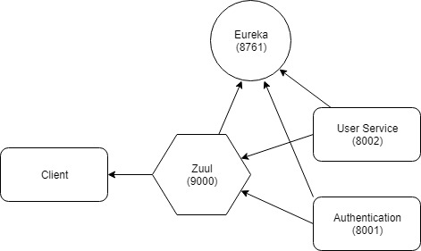
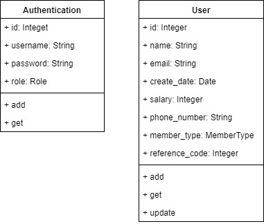

## Krungsri Assignment
Assignment for Krungsri 

Microservice using Spring Boot and JPA

## 1. Overview

##### Service Diagram

#### 

##### Class Diagram




## 2. Requirement

- [JDK 10](http://www.oracle.com/technetwork/java/javase/downloads/jdk10-downloads-4416644.html) and [JRE 10](http://www.oracle.com/technetwork/java/javase/downloads/jre10-downloads-4417026.html)

- Maven

- MySQL


## 3. Database

Create MySQL databases name 'krungsri_user' and 'krungsri_auth'

config username and password to 

username='root'

password=''

** you can change config in  ''\src\main\resources\application.properties'  of user service and auth service*

 *but need to build*


## 4. Start Service

to run all services you can run by JDK but need to set main class and  source root to  `/src/main/java`

or just import project to IDE 

btw I build .jar file of services for you 

but when you need to change config inside  you need to recreate .jar file

all services command need to change to project directory before run

ex. `cd eureka-server && mvn package -DskipTests && java -jar target/eureka-server-0.0.1-SNAPSHOT.jar`

#### 4.1 Eureka Server (Naming Server)

Naming server to map server IP Address to name

##### run

```
mvn package -DskipTests && java -jar target/eureka-server-0.0.1-SNAPSHOT.jar
```

#### 4.2 User Service

User Service to manage user in system. created for create, get, update, delete. you can change database config in resource.

##### run & test 

```
mvn package && java -jar target/user-service-0.0.1-SNAPSHOT.jar
```

##### test

```
mvn package && java -jar target/user-service-0.0.1-SNAPSHOT-tests.jar
```

#### 4.3 Authentication Service

Authentication service base on JWT. private key is HMAC-SHA256 signature. you can change private key and database config in resource.

##### run & test 

```
mvn package && java -jar target/auth-service-0.0.1-SNAPSHOT.jar
```

#####  test

```
mvn package && java -jar target/auth-service-0.0.1-SNAPSHOT-tests.jar
```

#### 4.4 Zuul (API Gateway)

API Gateway to every service at port 9000. use this port to map to public. all request will filter by security.

#####  run

```
mvn package -DskipTests && java -jar target/api-gateway-0.0.1-SNAPSHOT.jar
```


## 5.API

All requests are made to endpoints beginning: `http://localhost:9000/`

ex. `POST http://localhost:9000/auth `

some endpoint filter permission by Role and User Id

to add JWT header

KEY:  `'Authorization'`

VALUE:  `'Bearer {your_jwt_token}' `

##### Example 

create user first

`POST http://localhost:9000/users`

```{
{	
	"name" : "test name",
	"email" : "email@gmail.com",
	"salary" :50000,
	"phoneNumber" : "+66 845916998",
	"address": "This is example adress"``
}`
```

you will get user id and then create auth 

`POST http://localhost:9000/create_auth`

```
{
	"id": user_id,
	"username" : "test",
	"password" : "test"
}
```


auth by username and password

`POST http://localhost:9000/auth`

```
{
	"username" : "test",
	"password" : "test"
}
```

you will get JWT in header and JSON body

#### 5.1 Authentication

all endpoint have no permission now 

I have plan to move '/create_auth' to route from user service and close permission from API gateway

so JSON data from POST '/users' should contain username and password

##### Endpoint

| Endpoint     | Method | comment                                         |
| ------------ | ------ | ----------------------------------------------- |
| /auth        | POST   | to authentication and get JWT Token             |
| /create_auth | POST   | to create authentication after user is register |

##### Authentication Object

| Field    | Type    | *Auth Required | **Create Required | Description                                                  |
| -------- | ------- | -------------- | ----------------- | ------------------------------------------------------------ |
| Id       | Integer | no             | yes               | Id of user                                                   |
| username | String  | yes            | yes               | username use to get JWT token                                |
| password | String  | yes            | yes               | password use to get JWT token                                |
| role     | Enum    | no             | no                | role of user can  be {USER, ADMIN} will set to USER by default |

*Auth Required - this field is required when do authentication

**Create Required - this field is required when create authentication

#### 5.2 User

##### Endpoint

| Endpoint   | Method | comment              | Permission             |
| ---------- | ------ | -------------------- | ---------------------- |
| /users     | POST   | Add User             | Everyone               |
| /me        | GET    | Get my User from JWT | Only User              |
| /users/:Id | GET    | Get User             | Only User              |
| /users/:Id | PATCH  | Update User          | Only User with same Id |
| /users/:Id | DELETE | Delete User          | Only ADMIN Role        |

##### User Object

| Field          | Type    | Required | *Can Create | **Can Edit | Description                                                  |
| -------------- | ------- | -------- | ----------- | ---------- | ------------------------------------------------------------ |
| id             | Integer | no       | no          | no         | id of user                                                   |
| email          | String  | yes      | yes         | no         | email of user                                                |
| name           | String  | yes      | yes         | yes        | first name  and last name of user                            |
| address        | String  | no       | yes         | yes        | address of user                                              |
| salary         | Integer | yes      | yes         | yes        | salary of user                                               |
| phone_number   | String  | yes      | yes         | yes        | phone number of user                                         |
| register_date  | Date    | no       | no          | no         | register_date of user                                        |
| member_type    | Enum    | no       | no          | no         | member_type of user<br />PLATINUM (salary > 50,000 baht)  <br />GOLD (salary between 30,000 to 50,000)<br />SILVER (salary < 30,000) |
| reference_code | Long    | no       | no          | no         | Register process has to generate reference code from register date and last 4 digits of phone number like this “YYYYMMDDXXXX” (ex.
201708154652) |

*Can Create - this field can add to POST method

**Can Edit  - this field  can update to PATCH method


#### Improvement References

I have looking for methods to improve API performance and best practices  

I use some of it in this example project  btw there's many tip I haven't implement

you can check articles by following link

1. [10 Best Practices for Microservice Architectures](https://dzone.com/articles/10-best-practices-for-microservice-architectures)

2. [Spring boot starter for gRPC framework.](https://github.com/LogNet/grpc-spring-boot-starter)

3. [14 High-Performance Java Persistence Tips](https://vladmihalcea.com/14-high-performance-java-persistence-tips/)

4. [Microservices Authentication and Authorization Solutions](https://medium.com/tech-tajawal/microservice-authentication-and-authorization-solutions-e0e5e74b248a)

